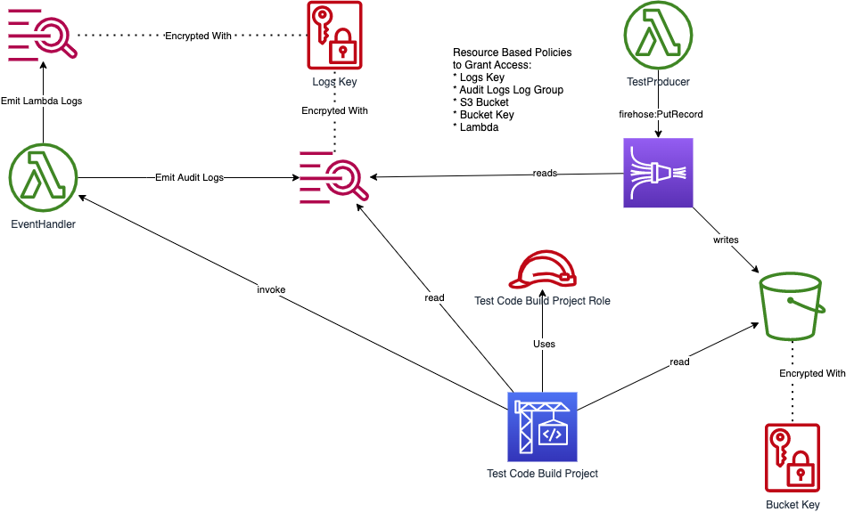

# Integration test using AWS resources

Integration tests that want to make use of AWS resources need to add
resource-based policies to grant the integration test permission to
access those resources.

The IAM role that needs to be granted these permissions is passed to
a SAM template using the `TestRoleArn` property. This property will
either be the ARN of the test role if the integration test stage
has been provisioned, or the value `none`.

The example application demonstrates use of this feature.



The [SAM template](app/template.yaml) for this application uses the
`TestRoleArn` to grant permissions to get and invoke the test Lambda 
and adds permissions to read the S3 bucket. It also provisions a test 
Lambda to perform the `firehose:PutRecord` action as there are no 
resource-based policies for working with Firehose.

The [integration test](aws-integration) uses the permissions to run
the following test scenarios:

```
Feature: demo
  Scenario: Process Audit Event
  Given I have an Event Handler deployed
  When  I invoke with an audit message "Hello World"
  Then  The audit message "Hello World" is emitted to a CloudWatch Log
  And   The audit message is written to an S3 Bucket
  
  Scenario: Put Records via Firehose
  Given I have a audit Firehose deployed
  When  I write the audit message "This is the Firehose" onto the Firehose
  Then  The audit message is written to an S3 Bucket
```

## Deployment
